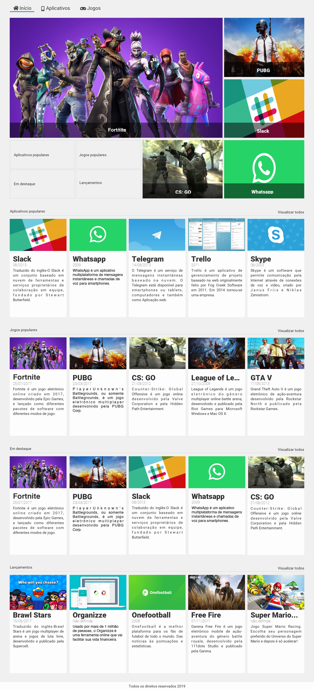

# css-grid

  

Este repositório é destinado ao projeto que desenvolvi com base nas aulas do "<b>Curso de CSS Grid: simplificando layouts</b>", da Alura, focado em CSS. 

## Alura Store:

O conteúdo deste curso é voltado exclusivamente para o desenvolvimento da página web <b> Alura Store </b> com layouts e templates complexos, sendo implementada através do <b>CSS Grid Layout</b>.

Além disso, o foco do curso está no desenvolvimento com <b>responsividade</b>.

**Objetivos principais:**

- Simplificar a criação de layouts complexos;
- Posicionar elementos com mais facilidade;
- Utilizar grid para calcular e alinhar elementos;
- Criar templates com mais eficiência e simplicidade;
- Indicar aos elementos onde eles devem se posicionar;
- Indicar aos elementos onde eles devem começar e terminar.

**Neste curso, as seguintes abordagens tiveram foco:**

- Definição de templates com `grid-template-areas`;
- Posicionamento dos elementos em suas áreas;
- Definição de colunas com `grid-template-columns`;
- Definição de linhas com `grid-template-rows`; 
- Definição de template sem áreas;
- Posicionamento dos elementos com `grid-column-start`, `grid-column-end`, `grid-row-start` e `grid-row-end`;
- Shorthand `grid-column` e `grid-row`;
- Metodologia BEM;
- Definição de espaçamento entre linhas e colunas;
- Cálculo de espaçamento com `calc()`; e
- Responsividade (`media queries`).

## Tecnologias 

- [HTML5](https://html.com/)
- [CSS3](https://www.w3.org/Style/CSS/Overview.en.html)

## Protótipo do projeto

## Resultados

Página web implementada:

Página responsiva/mobile:

## Status do projeto/curso

**Concluído.**